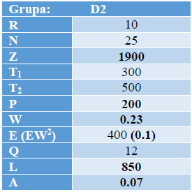
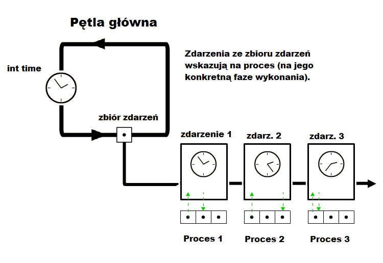

# Digital_simulation
Projekt stworzony na podstawie:
 

W symulacji cyfrowej wykorzystałem metode interakcji procesów:
Szpitalny punkt krwiodawstwa korzysta z monitoringu liczby dostęnych jednostek krwi. Jeżeli liczba ta spadnie do poziomu R lub niżej, zostaje wysłane zlecenie na N nowych jednostek. Czas od wysłania zamówienia do otrzymania krwi jest zmienną losową o rozkładzie wykładniczym o średniej Z. Dostarczona krew musi zostać wykorzystana w ciągu T1 jednostek czasu. Po tym czasie zostaje zutylizowana. Odstęp czasu pomiędzy pojawieniem się kolejnych pacjentów wymagających transfuzji jest zmienną losową o rozkładzie wykładniczym i średniej P. Liczba jednostek krwi podawana pojedynczemu pacjentowi jest zmienną losową o rozkładzie geometrycznym i średniej 1/W. Jeżeli liczba potrzebnych jednostek jest większa niż aktualny stan zaopatrzenia w punkcie krwiodawstwa, zostaje złożone awaryjne zamówienie na Q jednostek. Czas dostarczenia takiego zamówienia jest zmienną losową o rozkładzie normalnym, średniej E i wariancji EW2. Dodatkowo, w punkcie krwiodawstwa krew oddają lokalni dawcy. Czas między zgłoszeniem się kolejnych dawców jest zmienną losową o rozkładzie wykładniczym i średniej L. Każdy dawca oddaje jedną jednostkę krwi, która musi zostać zużyta w ciągu T2 jednostek czasu (T1 < T2). Celem symulacji jest wyznaczenie wartości R oraz N, dla których prawdopodobieństwo awaryjnego zamówienia jest mniejsze niż A. Dla otrzymanych wartości wyznacz jaki procent krwi jest utylizowany.
Dodatkowo pacjenci oraz dawcy mają jedną z dwóch możliwych grup krwi: A lub B. Pacjenci mogą przyjmować tylko krew swojego grupy. Prawdopodobieństwa występowania grup krwi wynoszą: 60% grupa A oraz 40% grupa B. Prawdopodobieństwa są takie same zarówno dla dawców jak i biorców. Dla każdej grupy krwi występują niezależne zamówienia (t.j. mogą istnieć w jednym momencie cztery zamówienia: dwa awaryjne oraz dwa standardowe, osobne dla każdej grupy krwi).

